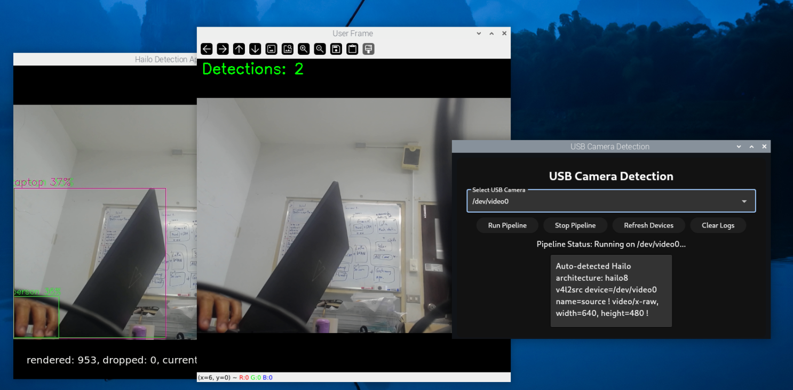

# Hailo Raspberry Pi 5 Examples

Welcome to the Hailo Raspberry Pi 5 Examples repository. This project showcases various examples demonstrating the capabilities of the Hailo AI processor on a Raspberry Pi 5. These examples will help you get started with AI on embedded devices.
The examples in this repository are designed to work with the Raspberry Pi AI Kit and AI HAT, supporting both the Hailo8 (26 TOPS) and Hailo8L (13 TOPS) AI processors. The examples can also be run on an x86_64 Ubuntu machine with the Hailo8/8L AI processor.
Visit the [Hailo Official Website](https://hailo.ai/) and [Hailo Community Forum](https://community.hailo.ai/) for more information.

## Table of Contents

- [Hailo Raspberry Pi 5 Examples](#hailo-raspberry-pi-5-examples)
  - [Table of Contents](#table-of-contents)
  - [Hailo Packages Installation](#hailo-packages-installation)
    - [Hailo Version Upgrade Instructions](#hailo-version-upgrade-instructions)
  - [Available Examples and Resources](#available-examples-and-resources)
    - [Hailo Python API](#hailo-python-api)
    - [Hailo Examples](#hailo-examples)
      - [Basic Pipelines (Python)](#basic-pipelines-python)
        - [Detection Example](#detection-example)
        - [Pose Estimation Example](#pose-estimation-example)
        - [Instance Segmentation Example](#instance-segmentation-example)
      - [CLIP Application](#clip-application)
      - [Frigate Integration - Coming Soon](#frigate-integration---coming-soon)
    - [Raspberry Pi Official Examples](#raspberry-pi-official-examples)
      - [rpicam-apps](#rpicam-apps)
      - [picamera2](#picamera2)
    - [Hailo Dataflow Compiler (DFC)](#hailo-dataflow-compiler-dfc)
  - [Contributing](#contributing)
  - [License](#license)
  - [Disclaimer](#disclaimer)

## Hailo Packages Installation

For installation instructions, see the [Hailo Raspberry Pi 5 installation guide](doc/install-raspberry-pi5.md#how-to-set-up-raspberry-pi-5-and-hailo).

### Hailo Version Upgrade Instructions

See the [Upgrade or Downgrade Hailo Software](doc/install-raspberry-pi5.md#hailo-version-upgrade-instructions) section for instructions on how to upgrade the Hailo software.

## Available Examples and Resources

### Hailo Python API
The Hailo Python API is now available on the Raspberry Pi 5. This API allows you to run inference on the Hailo-8L AI processor using Python.
For examples, see our [Python code examples](https://github.com/hailo-ai/Hailo-Application-Code-Examples/tree/main/runtime/python).
Additional examples can be found in RPi [picamera2](#picamera2) code.
Visit our [HailoRT Python API documentation](https://hailo.ai/developer-zone/documentation/hailort-v4-18-0/?page=api%2Fpython_api.html#module-hailo_platform.drivers) for more information.

### Hailo Examples

#### [Basic Pipelines (Python)](doc/basic-pipelines.md#hailo-rpi5-basic-pipelines)

These pipelines are included in this repository. They demonstrate object detection, human pose estimation, and instance segmentation in an easy-to-use format.
For installation instructions, see the [Basic Pipelines Installation Guide](doc/basic-pipelines.md#installation).
See our [Developement Guide](doc/basic-pipelines.md#development-guide) for more information on how to use the pipelines to create your own custom pipelines.

#### [Integration with Flet UI](doc/fletui.md#hailo-rpi5-basic-pipelines)

